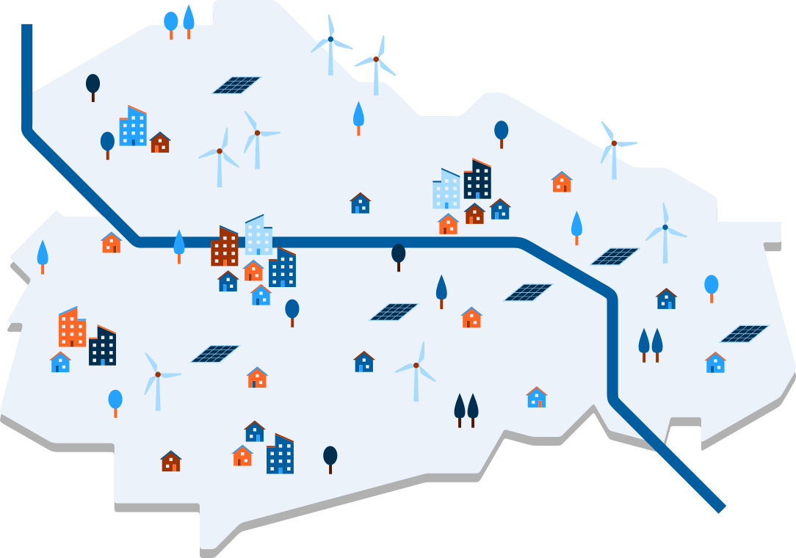

.. _about_label:

Über dieses Tool
================

Die Energiewende kann nur gemeinsam erreicht werden. Wie aber können alle
Interessensgruppen ihre Sichtweisen und Bedürfnisse in die Energiewendeplanung
einbringen? Das `Reiner Lemoine Institut (RLI)
<https://reiner-lemoine-institut.de/>`_ hat dieses Stakeholder-Empowerment-Tool
mit Unterstützung der `Energieavantgarde Anhalt e.V. (EAA)
<https://www.energieavantgarde.de/>`_ entwickelt, das es Akteurinnen und
Akteuren der Energiewende ermöglicht, sich an Planungsprozessen zu beteiligen.

Über das Menü links gelangen Sie auf die entsprechenden Seiten.

ENavi
-----
Das Tool wurde im Kopernikus-Projekt
„`ENavi <https://www.kopernikus-projekte.de/projekte/systemintegration>`_“
entwickelt, einem von vier Projekten der Förderinitiative Kopernikus des
Bundesministeriums für Bildung und Forschung (BMBF).

Förderkennzeichen: 03SFK4E1

::

  „Mit der Energiewende hat sich Deutschland zum Ziel gesetzt, das gegenwärtige
  Energiesystem in ein weitgehend CO2-freies und auf erneuerbaren Energien
  basierendes System zu transformieren. Ein wirtschaftliches,
  umweltverträgliches, verlässliches und sozialverträgliches Energiesystem
  benötigt eine ganzheitliche Betrachtung auf Systemebene. ENavi sieht die
  Energiewende daher als einen gesamtgesellschaftlichen Transformationsprozess
  und verknüpft wissenschaftliche Analysen mit politisch-gesellschaftlichen
  Anforderungen.“

Lizenz
------

*Copyright (C) 2018 Reiner Lemoine Institut gGmbH*

Dieses Programm ist Freie Software: Sie können es unter den Bedingungen
der GNU General Public License, wie von der Free Software Foundation,
Version 3 der Lizenz oder (nach Ihrer Wahl) jeder neueren
veröffentlichten Version, weiter verteilen und/oder modifizieren.

Dieses Programm wird in der Hoffnung bereitgestellt, dass es nützlich sein wird,
jedoch OHNE JEDE GEWÄHR,; sogar ohne die implizite
Gewähr der MARKTFÄHIGKEIT oder EIGNUNG FÜR EINEN BESTIMMTEN ZWECK.
Siehe die GNU General Public License für weitere Einzelheiten.

Sie sollten eine Kopie der GNU General Public License zusammen mit diesem
Programm erhalten haben. Wenn nicht, siehe <https://www.gnu.org/licenses/>.

This program is free software: you can redistribute it and/or modify
it under the terms of the GNU General Public License as published by
the Free Software Foundation, either version 3 of the License, or
(at your option) any later version.

This program is distributed in the hope that it will be useful,
but WITHOUT ANY WARRANTY; without even the implied warranty of
MERCHANTABILITY or FITNESS FOR A PARTICULAR PURPOSE.  See the
GNU General Public License for more details.

You should have received a copy of the GNU General Public License
along with this program.  If not, see <http://www.gnu.org/licenses/>.
