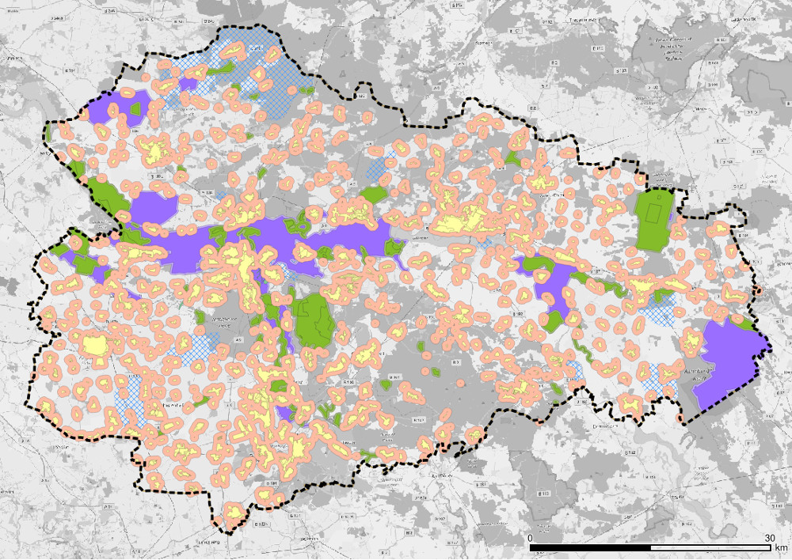
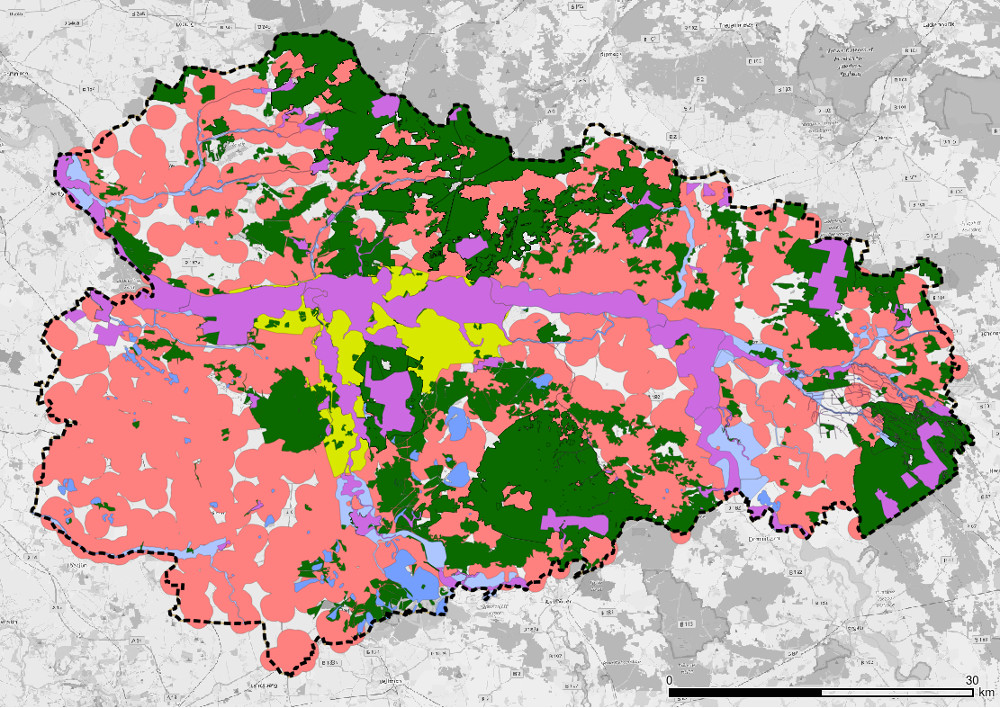
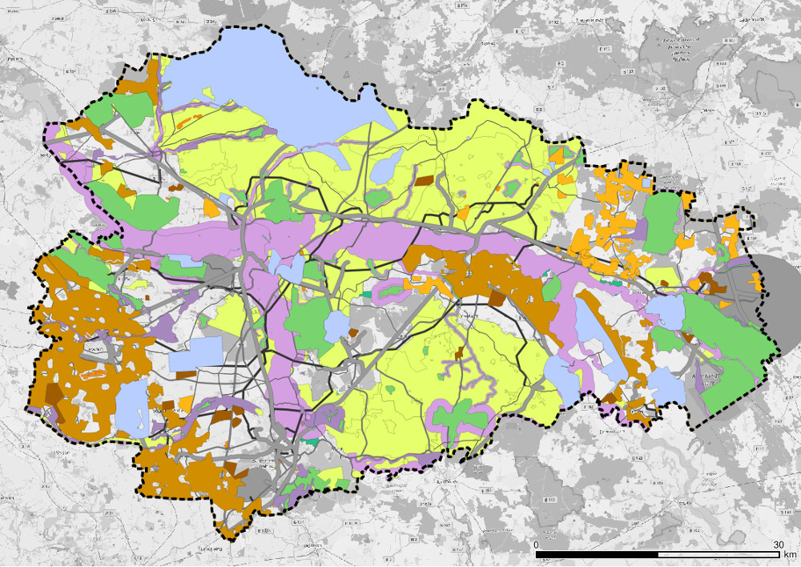
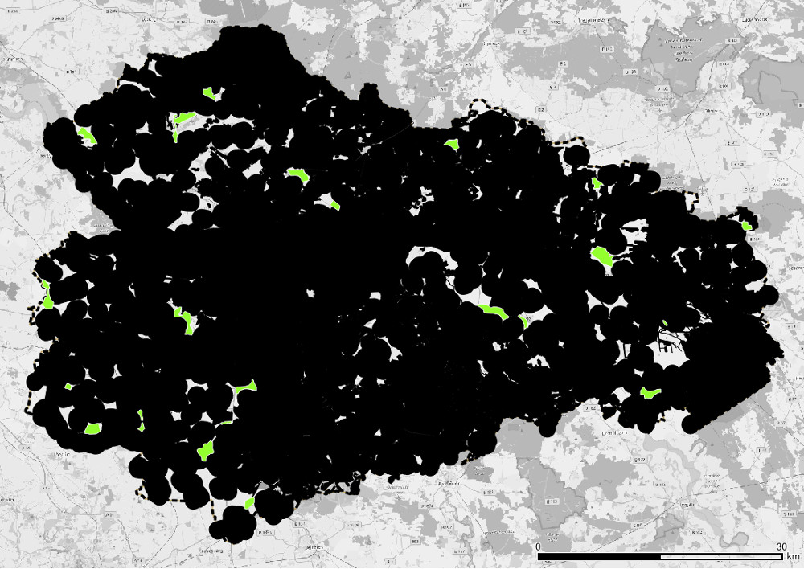
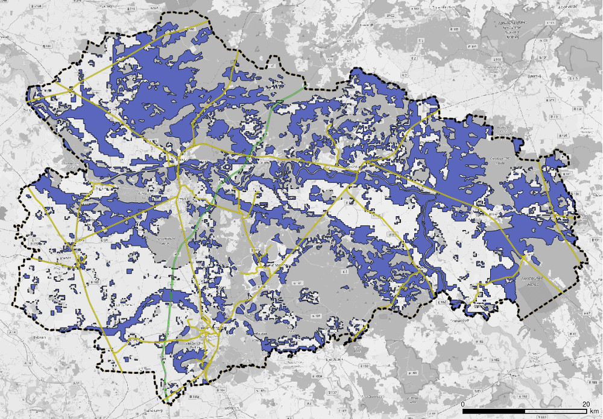
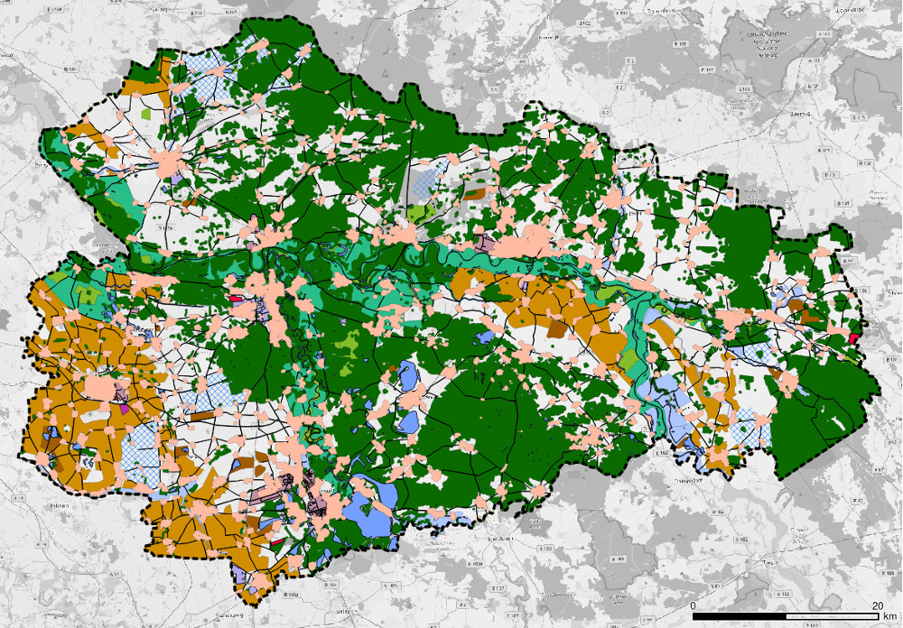
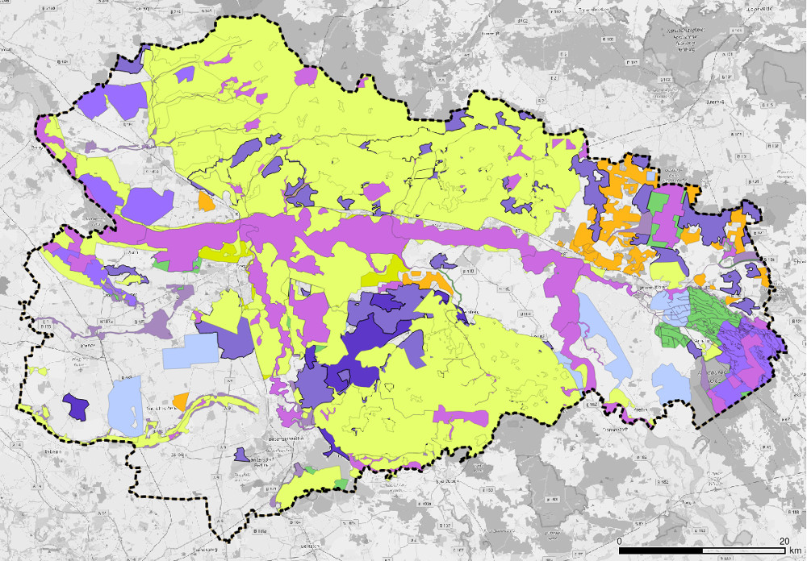
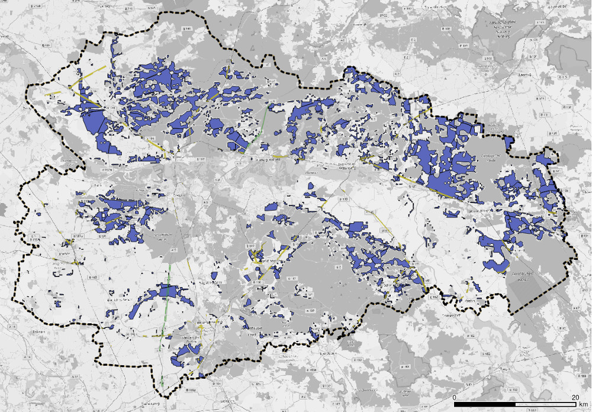

.. _areas_and_potentials_label:

Flächen und Potenziale
======================

Windenergieanlagen
------------------

Die Windenergie leistet in der Region Anhalt-Bitterfeld-Wittenberg (ABW) den
größten Beitrag zur erneuerbaren Stromgewinnung - Ende 2017 deckten 438 Anlagen
mit einer installierten Leistung von 717 Megawatt bilanziell bereits rund 45 %
des regionalen Strombedarfs. Der weitere Ausbau sowie das Repowering
bestehender Anlagen spielt eine entscheidende Rolle bei der Transformation des
Energiesystems hin zu einer erneuerbaren Energieversorgung.

Potenzialflächen
................

Grundsätzlich gilt: WEA sind privilegierte Vorhaben nach `§35 BauGB`_. Jedoch
bedarf es einer Abwägung von wichtigen Belangen wie bspw. Natur- und
Anwohnerschutz sowie der Steuerung der Windenergieplanung durch Ausweisung
sog. Konzentrationsgebiete in Regional- und Flächennutzungsplänen mit
Ausschlusswirkung im restlichen Planungsraum.

In ABW obliegt es der Regionalen Planungsgemeinschaft, derartige
Vorrang-/Eignungsgebiete (VR/EG) auszuweisen und in Form eines Teilplans
(`Teilplan Wind ABW 2018`_) zu veröffentlichen. Der Planungsraum umfasst die
Landkreise Wittenberg, Anhalt-Bitterfeld sowie die kreisfreie Stadt
Dessau-Roßlau (`Regionalplan ABW 2018`_).

Vereinfacht dargestellt werden vom Planungsraum Restriktionsflächen (sog.
"harte" und "weiche" Tabuzonen, s.u.) abgezogen, die aus verschiedenen Gründen
(z.B. Naturschutz, vorhandener Infrastruktur, andersartigen Interessen etc.)
für die Windenergienutzung nicht zur Verfügung stehen. Es resultieren
potenziell geeignete Flächen - der sog. "Suchraum" - die rund 10 % des gesamten
Planungsraums ausmachen. Diese Flächen werden einer Einzelfallprüfung (s.u.)
unterzogen, die wiederum zu einem Ausschluss von etwa 90 % des Suchraums
führen. Resultierend stehen somit für sie Ausweisung von VR/EG noch ca. 1 % des
Planungsraums zur Verfügung, tatsächlich ausgewiesen als VR/EG wurden 3590 ha
(0,98 %), vgl. `Teilplan Wind ABW 2018`_.

Restriktionsflächen
...................

Im Folgenden wird die Zusammensetzung der oben genannten Restriktionsflächen
detaillierter beschrieben:

:Harte Restriktionen (Tabuzonen):
    - Siedlungsflächen mit überwiegender Wohn- und Erholungsnutzung, Kur- und
      Klinikgebiete (+500 m Puffer (`Teilplan Wind ABW 2018`_))
    - Verkehrs-, Sonder- und Hubschrauberlandeplätze
    - Naturschutzgebiete (+200 m Puffer (`UBA 2013`_))
    - Geschützte Landschaftsbestandteile
    - SPA-/Vogelschutzgebiete (+200 m Puffer (`UBA 2013`_))
    - Trinkwasserschutzgebiete Zone I + II

:Weiche Restriktionen (Tabuzonen):
    - 1000 m-Pufferzone um Siedlungsflächen mit überwiegender Wohn- und
      Erholungsnutzung, Kur- und Klinikgebiete (`Teilplan Wind ABW 2018`_)
    - Flora-Fauna-Habitat (FFH)-Gebiete
    - Wald gem. § 2 WaldG LSA
    - UNESCO-Welterbegebiete
    - Überschwemmungsgebiete
    - Gewässer, stehend >1 ha (+65 m Puffer (`UBA 2013`_))
    - Fließgewässer 1. Ordnung (+65 m Puffer (`UBA 2013`_))

:Abwägungsflächen/Einzelfallprüfung:
    - Schutzabstände zu FFH-Gebieten (je nach Vorkommen von Bechsteinfledermaus
      oder Großes Mausohr +200...1000 m (`Teilplan Wind ABW 2018`_))
    - Landschaftsschutzgebiete
    - Naturparke
    - Biosphärenreservate
    - Vorbehaltsgebiete für den Aufbau eines ökölogischen Verbundsystems
    - Vorranggebiete für Natur und Landschaft
    - Naturdenkmale
    - Flächennaturdenkmale
    - Wasserschutzgebiet Zone III, Vorranggebiet für Wassergewinnung
    - Vorrang- und Vorbehaltsgebiete für die Landwirtschaft
    - Vorrang- und Vorbehaltsgebiete für die Rohstoffgewinnung
    - Kommunale Planungen und Planabsichten, Landschaftsbild, private Belange,
      Erfordernisse der Raumordnung
    - Technische Infrastruktur und Vorbelastung
        - BAB (+100 m Puffer (`UBA 2013`_))
        - Bundesstraßen (+80 m Puffer (`UBA 2013`_))
        - Land- und Kreisstraßen (+20 m Puffer (`Teilplan Wind ABW 2018`_))
        - Schienenwege (+250 m Puffer (`UBA 2013`_))
        - Bahnanlagen
        - Flugverkehrsanlagen (je nach Nutzung +1760 m (zivil) (`UBA 2013`_)
          ... 6 km (militärisch) (`Teilplan Wind ABW 2018`_) Puffer)
        - Hochspannungsleitungen (+120 m Puffer (`UBA 2013`_))
        - Photovoltaik-Freiflächenanlagen

Folgende Grafik zeigt die nach Ausschluss von harten und weichen Tabuzonen
(schwarz) verbleibenden Flächen sowie die letztendlich ausgewiesenen
Vorrang-/Eignungsgebiete (VR/EG) (grün):

Repowering
..........

In Anlehnung an `MLV 2018`_ ermöglicht das Tool die Einstellung verschiedener
Repowering-Szenarien, die im Folgenden beschrieben werden. Zu beachten ist,
dass diese Varianten teilweise unvereinbar mit der aktuellen Rechts- und
Planungslage sind (vgl. `LEntwG LSA`_, ). Entsprechend dem visionären Charakter des Tools sollen sie
vielmehr alternative Pfade beim Ausbau der Windenergie aufzeigen:

1. **Kein Repowering:** Es wird kein Repowering vorgenommen (nur heutige
   Anlagen vorhanden, mittlere Volllaststunden 2011-2015 für gesamte Region:
   1630 (`AEE 2018`_)).

2. **1:1-Repowering (standorttreu):** Standorttreues Repowering aller heute in
   Betrieb befindlichen Altanlagen durch eine neue Anlage, sowohl innerhalb als
   auch außerhalb von Vorranggebieten (VR/EG) für Windenergie.

3. **Volle Nutzung VR/EG:** In allen aktuellen Vorranggebieten (VR/EG) für
   Windenergie wird ein Maximum an Neuanlagen installiert. Alle Anlagen
   außerhalb dieser Gebiete werden abgebaut.

4. **Variabler Zubau:** Bei diesem Szenario können neben den Vorranggebieten
   (VR/EG) zusätzliche Flächen für die Windenergie freigegeben werden, die sich
   aus veränderten Siedlungsabständen und/oder der Nutzung von Waldflächen
   ergeben.

Die jeweiligen Potenziale können dem Abschnitt Ergebnisse entnommen werden.

Randbedingungen
...............

Für den Windenergieausbau innerhalb des Tools gelten folgende Vereinfachungen:

- Die **Altersstruktur** der bestehenden Windenergieanlagen wird
  vernachlässigt, d.h. es wird kein sukzessiver Zubau berücksichtigt.
- Es wird keine Optimierung der Anlagenanordnung vorgenommen. Stattdessen wird
  **pauschal ein Flächenbedarf** von 20 Hektar pro Anlage zugrunde gelegt
  (basierend auf `MLV 2018`_, `UBA 2013`_ und `BMWi 2017`_).

Musteranlage
............

Als Neuanlage wird in den **Repowering-Szenarien 2-4** vereinfacht eine Enercon
E-141 (4,2 MW) mit einer Nabenhöhe von 159 m angenommen (im Mittel 2500
Volllaststunden in der gesamten Region).

Durch die höhere Effizienz neuer Anlagen kann bei gleicher installierter
Leistung ein höherer Ertrag erreicht werden. Wenn Sie im Tool also das
Repowering bzw. den freien Zubau aktiviert haben, führt dies auch ohne
zusätzliche Kapazitäten stets zu einem höheren Ertrag.

Ergebnisse
..........

1. **Kein Repowering:** Keine Änderungen

2. **1:1-Repowering (standorttreu):** 438 WEA * 4,2 MW/WEA = **1840 MW**

3. **Volle Nutzung VR/EG:** 3590 ha / 20 ha/WEA * 4,2 MW/WEA = **752 MW**

4. **Variabler Zubau:** Die Flächenpotenziale und maximal installierbare
   Leistung hängen von den vorgenommenen Flächeneinstellungen ab und sind in
   folgender Tabelle aufgeführt. Grundlage bilden die harten und weichen
   Tabuzonen.
   Während die Rechtslage und damit der Ausschluss der harten und weichen
   Tabuzonen klar geregelt ist, konnten jene Flächen, die einer
   Abwägung/Einzelfallprüfung unterliegen, im Projekt nicht eindeutig bewertet
   werden: Die Bewertung im `Teilplan Wind ABW 2018`_ erfolgt anhand eines
   Punktesystems, das als Grundlage nichtöffentliche Daten verwendet. Daher
   wird in Anlehnung an den `Teilplan Wind ABW 2018`_ angenommen, dass
   lediglich 10 % der (nach Ausschluss harter und weicher Tabuzonen)
   resultierenden Flächen zur Verfügung stehen.

+-------------------------------+---------------------+-------------+-----------------------+----------------+
| **Abstand zu**                | **Wald**            | **Ergebnisse**                                       |
| **Siedlungen [m]**            | **verwenden?**      +-------------+-----------------------+----------------+
|                               |                     | Fläche [ha] | Installierbare Anzahl | Installierbare |
|                               |                     |             | WEA (10% der Fläche)  | Leistung [MW]  |
+-------------------------------+---------------------+-------------+-----------------------+----------------+
| 500                           | nein                | 87847       | 439                   | 1844           |
+-------------------------------+---------------------+-------------+-----------------------+----------------+
| 1000                          | nein                | 30713       | 154                   | 752            |
+-------------------------------+---------------------+-------------+-----------------------+----------------+
| 1500                          | nein                | 7461        | 37                    | 155            |
+-------------------------------+---------------------+-------------+-----------------------+----------------+
| 500                           | ja                  | 147652      | 738                   | 3100           |
+-------------------------------+---------------------+-------------+-----------------------+----------------+
| 1000                          | ja                  | 69057       | 345                   | 1449           |
+-------------------------------+---------------------+-------------+-----------------------+----------------+
| 1500                          | ja                  | 25629       | 128                   | 538            |
+-------------------------------+---------------------+-------------+-----------------------+----------------+

Der im Menü-Regler des Tools angezeigte Wert stellt die maximal installierbare
unter den gewählten Randbedingungen dar.

Freiflächen-Photovoltaikanlagen
-------------------------------

Freiflächen-Photovoltaikanlagen leisten mit einer installierten Kapazität von
445 Megawatt und einem Anteil von rund 18 % am Strombedarf der Region bereits
Ende 2017 einen entscheidenden Beitrag. Der weitere Ausbau ist ein wichtiger
Bestandteil auf dem Weg zu einer vollständig erneuerbaren Energieversorgung,
welcher in Abwägung mit der Raum- und Umweltwirkung erfolgen muss.

Potenzialflächen
................

Die Potenzialflächen werden in Anlehnung an die aktuelle Förderkulisse nach
`§37 EEG`_ (2017) bestimmt. Es werden die folgenden Flächen berücksichtigt:

:110 m-Streifen entlang von Bundesautobahnen und Schienenwegen:
    Eine 110 m-Pufferzone um BAB und Schienenwege, abzüglich einer 40 m-Zone um
    BAB (`§9 FStrG`_) und 10 m-Zone bei Schienenwegen (`ZSW 2018`_) wird
    genutzt. Es werden weiterhin eine Breite von 24 m (BAB) respektive 12
    m (Schienenwege) angenommen.

:Böden mit geringem ackerbaulichen Ertragspotenzial (Bodengüte):
    Große Flächenpotenziale sind in den landwirtschaftlich genutzten Gebieten
    zu finden. In Anlehnung an `ZSW 2019`_ werden Flächen mit geringem
    ackerbaulichen Ertragspotenzial (Bodengüte) herangezogen. Hierfür werden
    die Ackerflächen und Wiesen aus Corine Land Cover (`CLC 2018`_) mit den
    Flächen sehr und äußerst geringer Bodengüte (<50) laut Soil Quality Rating
    der Bundesanstalt für Geowissenschaften und Rohstoffe (`BGR 2014`_)
    verschnitten.

    In der aktuellen Planung sollen laut Klima- und Energiekonzept des Landes
    Sachsen-Anhalt (`MULE 2019`_) "die Errichtung von
    Photovoltaik-Freiflächenanlagen auf landwirtschaftlich genutzten Flächen
    weitestgehend vermieden werden". Um dieser Einschränkung Rechnung zu
    tragen, werden von den resultierenden Flächen (nach Abzug der
    Restriktionsflächen, s.u.) lediglich **0,5 % als raumverträglich
    verfügbar** angenommen (`ZSW 2019`_).

Weitere in der Förderkulisse des EEG enthaltenen Standorte Konversionsflächen
und bundeseigene Immobilien finden hier aufgrund des vergleichsweise geringen
Potenzials und mangelhafter Datenverfügbarkeit keine Berücksichtigung.

Restriktionsflächen
...................

Den Potenzialflächen entgegen stehen Restriktionsflächen, in welchen die
Errichtung von Photovoltaikanlagen ausgeschlossen (hart) oder unwahrscheinlich
(weich) ist. Hierbei wurden sowohl die aktuelle Rechtslage als auch
Planungskriterien einbezogen (vgl. `BMVI 2015`_).

:Harte Restriktionen:
    - Siedlungsflächen (+100 m Puffer)
    - Verkehrswege
        - BAB: (24 m Breite, +40 m Puffer)
        - Bundes-, Land- und Kreisstraßen (+20 m Puffer)
        - Nebenstraßen  (5 m Breite)
        - Schienenwege (12 m Breite, +10 m Puffer)
    - Bahnanlagen
    - Flugverkehrsanlagen
    - Gewässer, stehend und fließend (+20 m Puffer)
    - Wald (+100 m Puffer)
    - Naturschutzgebiete
    - Nationalpark (in ABW n.V.)
    - Biosphärenreservate
    - Überschwemmungsgebiete
    - Flächenhafte Naturdenkmale
    - Wasserschutzgebiete
    - Harte Restriktionsflächen nach `Regionalplan ABW 2018`_
        - Vorranggebiete für die Landwirtschaft
        - Vorranggebiete für die Rohstoffgewinnung
        - Landesbedeutsame Industrie- und Gewerbestandorte (Bestand + Planung)
        - Region bedeutsame Standort für Industrie und Gewerbe (Bestand + Planung)

:Weiche Restriktionen:
    - FFH-Gebiete
    - SPA-/Vogelschutzgebiete
    - Landschaftsschutzgebiete
    - Vorbehaltsgebiete für den Aufbau eine ökologischen Verbundsystems
    - Vorranggebiete für Forstwirtschaft
    - Naturparke
    - Vorranggebiete für Natur und Landschaft
    - Vorranggebiete für Wassergewinnung
    - Vorbehaltsgebiete für Tourismus und Erholung
    - UNESCO Weltkulturerbegebiet (Gartenreich Dessau-Wörlitz)
    - Vorbehaltsgebiete für Landwirtschaft

Randbedingungen
...............

- Aus wirtschaftlichen Gründen werden nur Gebiete >1 ha berücksichtigt
- Bereis bestehende Anlagen und damit genutzte Flächen werden vernachlässigt
- Für den spezifischen Flächenbedarf werden 2,5 Hektar pro installiertem
  Megawatt (peak) angenommen (`BMWi 2017`_).

Ergebnisse
..........

Um das tatsächlich verfügbaren Flächen zu bestimmen, werden die
Restriktionsflächen von den Potenzialflächen abgezogen. Es ergeben sich die
folgenden Potenziale für Flächen und maximal installierbare Leistung:

+---------------------+-------------+----------------+-------------+----------------+
|                     | Harte Restriktionen          | Harte + Weiche Restriktionen |
|                     +-------------+----------------+-------------+----------------+
|                     | Fläche [ha] | Leistung [MWp] | Fläche [ha] | Leistung [MWp] |
+=====================+=============+================+=============+================+
| Bundesautobahn      | 226,0       | 90,4           | 138,0       | 55,2           |
+---------------------+-------------+----------------+-------------+----------------+
| Schienenwege        | 1959,0      | 783,6          | 963,0       | 385,2          |
+---------------------+-------------+----------------+-------------+----------------+
| Äcker und Wiesen    | 2267,6      | 907,0          | 699,9       | 280,0          |
+---------------------+-------------+----------------+-------------+----------------+
| **Summe**           | 4452,6      | **1781,0**     | 1800,9      | **720,4**      |
+---------------------+-------------+----------------+-------------+----------------+

**Der im Menü-Regler angezeigte Wert stellt die maximal installierbare
Nennleistung mit harten Restriktionsflächen dar**.

.. _`§37 EEG`: https://www.gesetze-im-internet.de/eeg_2014/__37.html
.. _`§9 FStrG`: https://www.gesetze-im-internet.de/fstrg/__9.html
.. _`ZSW 2018`: https://www.erneuerbare-energien.de/EE/Redaktion/DE/Downloads/bmwi_de/bericht-eeg-4-solar.pdf?__blob=publicationFile&v=4
.. _`ZSW 2019`: https://www.zsw-bw.de/fileadmin/user_upload/PDFs/Aktuelles/2019/politischer-dialog-pv-freiflaechenanlagen-studie-333788.pdf
.. _`CLC 2018`: https://land.copernicus.eu/pan-european/corine-land-cover/clc2018
.. _`BGR 2014`: https://www.bgr.bund.de/DE/Themen/Boden/Ressourcenbewertung/Ertragspotential/Ertragspotential_node.html
.. _`MULE 2019`: https://mule.sachsen-anhalt.de/fileadmin/Bibliothek/Politik_und_Verwaltung/MLU/MLU/04_Energie/Klimaschutz/00_Startseite_Klimaschutz/190205_Klima-_und_Energiekonzept_Sachsen-Anhalt.pdf
.. _`BMVI 2015`: https://www.bbr.bund.de/BBSR/DE/Veroeffentlichungen/ministerien/BMVI/BMVIOnline/2015/DL_BMVI_Online_08_15.pdf?__blob=publicationFile&v=2
.. _`Regionalplan ABW 2018`: https://www.planungsregion-abw.de/wp-content/uploads/2019/05/REP-ABW_2018_Text.pdf
.. _`Teilplan Wind ABW 2018`: https://www.planungsregion-abw.de/wp-content/uploads/2018/08/Teilplan_Wind_II_Final_genehmigt_01082018.pdf
.. _`BMWi 2017`: https://www.bmwi.de/Redaktion/DE/Downloads/B/berichtsmodul-2-modelle-und-modellverbund.pdf?__blob=publicationFile&v=6
.. _`UBA 2013`: https://www.umweltbundesamt.de/sites/default/files/medien/378/publikationen/potenzial_der_windenergie.pdf
.. _`MLV 2018`: https://mlv.sachsen-anhalt.de/fileadmin/Bibliothek/Politik_und_Verwaltung/MLV/MLV/Service/Publikationen/Abschlussbericht_der_interministeriellen_Arbeitsgruppe__Repowering__zur_Modernisierung_von_Windenergieanlagen_in_Sachsen-Anhalt.pdf
.. _`§35 BauGB`: https://www.gesetze-im-internet.de/bbaug/__35.html
.. _`AEE 2018`: https://www.foederal-erneuerbar.de/landesinfo/bundesland/ST/kategorie/wind/auswahl/811-durchschnittliche_ja/#goto_811
.. _`LEntwG LSA`: http://www.landesrecht.sachsen-anhalt.de/jportal/portal/t/194k/page/bssahprod.psml/screen/JWPDFScreen/filename/LEntwG_ST.pdf
