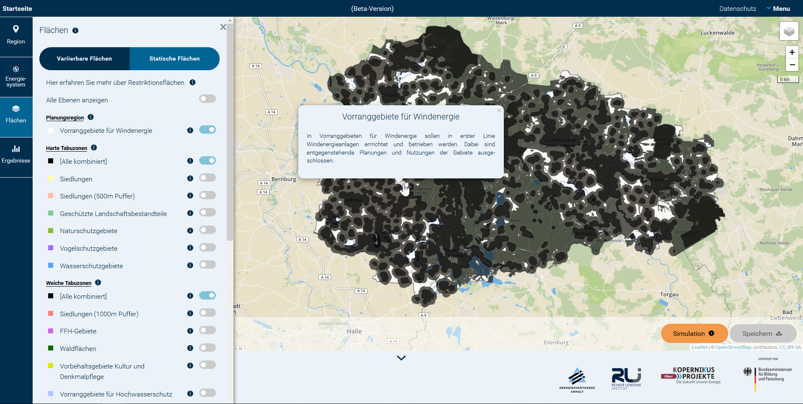

.. _usage_label:

Verwendung
==========

Eine kurze Einführung in das Tool ist bereits auf der `Startseite
<https://wam.rl-institut.de/stemp_abw/>`_ gegeben. Im Folgenden werden die
wichtigsten Elemente und Funktionen der Benutzeroberfläche beschrieben.

Aufbau des Tools
----------------

Das Tool hat unterschiedliche Funktionalitäten, die in der Legende links aufgeführt sind. Es ist möglich, sich die Region, deren Energiesystem und die Flächennutzung anzeigen zu lassen. Eine weitere Anwendung ist die Optimierung des Energiesystems unter selbst vorgegebenen Bedingungen. Von dieser kann man sich die Ergebnisse nach der Simulation anzeigen und abspeichern lassen. Die einzelnen Funktionen sind im Weiteren näher beschrieben. Durch Hovern über die dunkelblau hinterlegten Informationsbuttons ''i'' können weitere Informationen abgefragt werden. Diese öffnen sich nach wenigen Sekunden, wenn man die Maus darüber bewegt.
Über den Button ''Startseite'' gelangt man wieder auf die Anfangsseite der App, wo man einige Informationen zur App nachlesen kann. Unter ''Datenschutz'' lassen sich die aktuellen diesbezüglichen Bestimmungen anzeigen. Im ''Menu'' finden sich Kontaktdaten sowie die Angabe von Quellen und Annahmen, die der Anwendung zu Grunde liegen. Außerdem kann man sich hier zurück ''Zum Tool'' navigieren lassen. 

.. 	image:: files/Startbildschirm.png
   :width: 500 px
   :alt: Startseite des Tools
   :align: center
   

Panels
------

Die App umfasst die Panels ''Region'', ''Energiesystem'',  ''Flächen'' und ''Ergebnisse'', deren Aufbau und Handhabung nachfolgend beschrieben ist.

Region
......

Diese Funktionalität stellt grafisch aufbereitete Informationen zur Region und deren Energiesystem dar. Dabei werden Eckdaten der Region, Informationen zur Einspeisung aus Erneuerbaren Energien und zum Energiebedarf der einzelnen Gemeinden bereitgestellt.

Die Abbildung zeigt eine beispielhafte Nutzung. Links im Panel kann der Nutzer auswählen, welche der Daten dargestellt werden sollen. Hier ist 'Gewonnene Energie aus EE' angewählt, welche auf der Karte gemeindescharf dargestellt ist. Außerdem werden die Standorte der Windenergieanlagen angezeigt. Durch Anklicken einer Gemeinde öffnet sich eine Informationstafel über die angewählte Funktionalität, hier Erzeugung aus EE. Dort finden sich nähere Informationen zu der ausgewählten Gemeinde, in diesem Fall die jährlich eingespeiste Energiemenge und die Anteile einzelner Energieträger. Im Beispiel wird der größte Anteil der 190 GWh durch Windenergie bereit gestellt.

.. 	image:: files/Kartenansicht.png
   :width: 650 px
   :alt: Kartenansicht Region
   :align: center

Energiesystem
.............

Das Panel ''Energiesystem'' ermöglicht die Variation und Untersuchung desselben in der Region. Als erster Schritt kann ein Vergleichs-Szenario ausgewählt werden, in Relation zu welchem die Ergebnisse angezeigt werden. Danach ist es möglich, über die Reiter ''Stromerzeugung'', ''Strombedarf'', ''Wärmeerzeugung'' und ''Wärmebedarf'' die entsprechenden Größen individuell anzupassen. In den Bedarfsfällen können jeweils die prozentualen Einsparungen zum Vergleichsszenario in Haushalten sowie in Gewerbe, Handel und Dienstleistungen (GHD) definiert werden. Bei der Stromerzeugung dagegen gibt es mehr Einstellparameter. Für die einzelnen Erzeuger sind die Leistungen des Vergleichsszenarios voreingestellt. Es wird außerdem automatisch das Potenzial der erneuerbaren Erzeuger, gemessen an ausgewähltem Zubau-Szenario und Flächennutzung, errechnet. Die Regler können entsprechend verschoben werden, um die gewünschte installierte Kapazität der Erzeuger einzustellen. Das Zubau-Szenario bezieht sich auf Windenergieanlagen und beeinflusst auch die Flächennutzung, was im folgenden Unterkapitel näher erläutert wird. Bei der Wärmeerzeugung kann der prozentuale Anteil von Power-to-Heat in Haushalten und GHD verändert werden. 

Flächen
.......

Dieses Panel beinhaltet zwei Ebenen, die statische und die variierbare. ''Statische Flächen'' zeigt optisch aufbereitete Informationen zur Flächennutzung in der Region. Dabei sind vor allem für Planungen von Windergieanlagen relevante Informationen zusammengefasst. Die Informationen, die dargestellt werden können, sind in verschiedene Kategorien eingeteilt. Unter ''Planungsregion'' können die Vorranggebiete für Energie angezeigt werden. Dies sind die Gebiete in der Region, die sich am besten zur Errichtung von Windenergieanlagen eignen und in denen keine Konflikte mit anderen Flächennutzungsoptionen auftreten. Unter der Überschrift ''Harte Tabuzonen'' sind Gebiete zusammengefasst, in denen nach aktueller Rechtslage kein Bau von Windenergieanlagen möglich ist. Unter ''Weiche Tabuzonen'' aufgeführte Flächen unterliegen zwar aktuell genauso dem Verbot der Bebauung durch Windenergieanlagen. Hier besteht allerdings mehr Gestaltungsspielraum und durch Anpassung der rechtlichen Rahmenbedingungen könnten diese nutzbar gemacht werden. Unter ''Einzelfallprüfung'' sind solche Gebiete zusammengefasst, bei denen es einer individuellen Abwägung der Interessen bedarf, um zu entscheiden, ob hier der Bau von Windenergieanlagen erlaubt werden sollte. 

Die Abbildung zeigt die Darstellung aller harten und weichen Tabuzonen in dunkelgrau und grau, sowie der Voranggebiete für Windenergie in weiß. Dieses Panel kann veranschaulichen, wie begrenzt die tatsächlich für Windenergieanlagen zur Verfügung stehenden Flächen sind und wie hoch die Flächenkonkurrenz im untersuchten Gebiet. Diese Visualisierung kann außerdem als Grundlage für Diskussionen über Regularien und Rahmenbedingungen genutzt werden.

Den Reiter ''Variierbare Flächen'' kann man wie das Energiesystem-Panel dazu nutzen, ein eigenes Szenario näher zu definieren, um es dann mit einem Referenz-Szenario zu vergleichen. Diese Option kann allerdings nur dann genutzt werden, wenn als Zubau-Szenario für Windenergie die Option ''Freier Zubau'' ausgewählt wurde. Dann kann einerseits der gesetzlich vorgeschriebene Abstand von Windenergieanlagen zu Gemeinden variiert und andererseits ausgewählt werden, ob Waldflächen für die Bebauung freigegeben werden sollen. Verändert man diese Optionen, so gleicht sich auch das Potenzial der installierbaren Leistung von Windenergieanlagen unter ''Energiesystem'' an. 

Ergebnisse
..........

Wurden unter ''Energiesystem'' und/oder ''Flächen'' Änderungen zum Vergleichsszenario vorgenommen, so kann eine Simulation durch Anklicken des entsprechenden Buttons gestartet werden. Diese berechnet dann Erzeugungs- und Verbrauchstdaten mit dem neuen Erzeugungspool. Die Ergebnisse der Simulation können im gleichnamigen Panel eingesehen werden. 

Die unter ''Ergebnisse für die Planungsregion'' zusammengefassten Reiter können dazu genutzt werden, sich diese auf der Karte anzeigen zu lassen. Durch Anwählen von ''Mehr Ergebnisse +'' können Details eingesehen werden. In einer ''Übersicht'' ist die anteilige Erzeugung der unterschiedlichen Erzeugerarten des neu definierten Szenarios dem Vergleichsszenario gegenüber gestellt. Unter den Reitern ''Energieerzeugung'', ''Wärmebedarf'' und ''Strombedarf'' ist eine genauere monatliche Darstellung der entsprechenden Größen zu finden. 

Diese Funktionalität kann dazu genutzt werden, Zukunftsszenarien zu simulieren und unterschiedliche Arten zu beleuchten, vorgegebene Zielsetzungen zu erreichen. So können sowohl der Zubau an erneuerbaren Erzeugern als auch die Reduktion des Verbrauchs zu einer Verminderung der Treibhausgase führen. Den Verantwortlichen der Region steht somit ein Instrument zur Verfügung, unterschiedliche Zukunftsszenarien zu simulieren und hinsichtlich vorher festzulegender Kriterien zu vergleichen.

