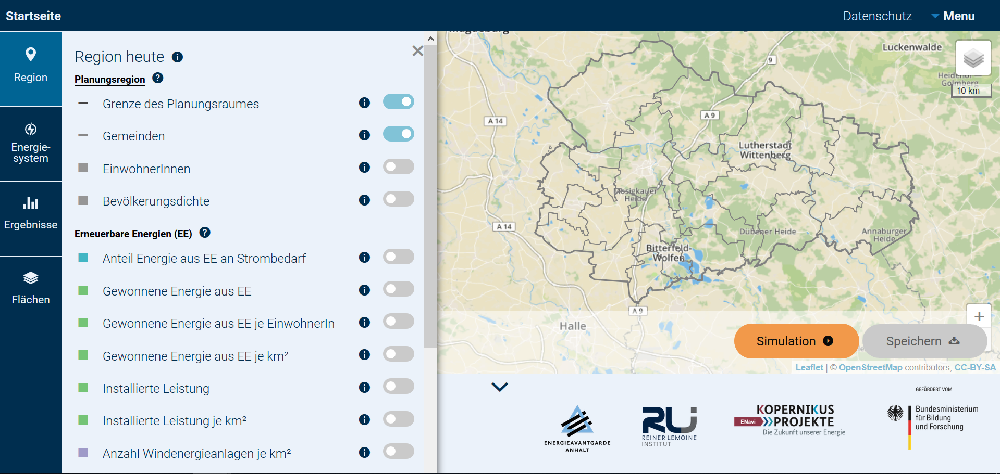
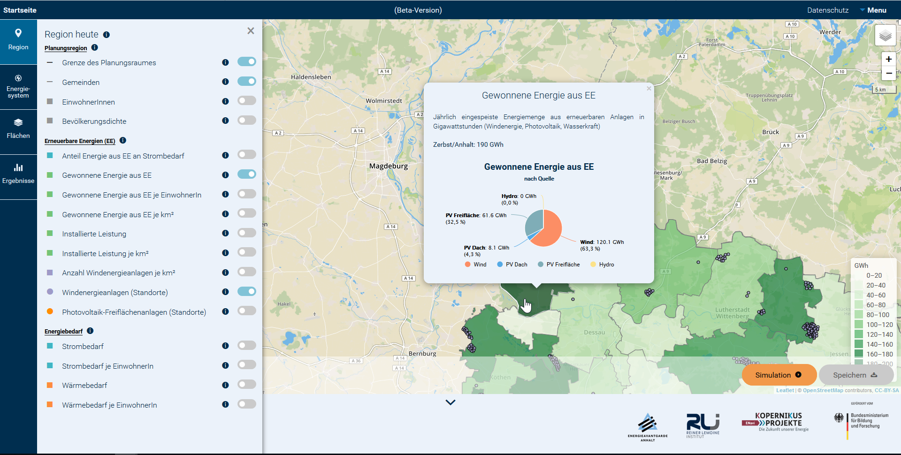
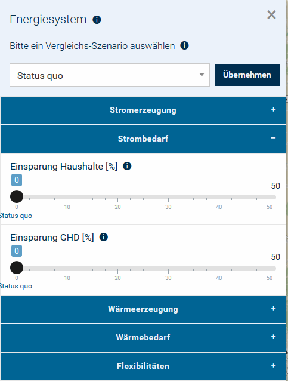

.. _usage_label:

Verwendung
==========

Eine kurze Einführung in das Tool ist bereits auf der `Startseite
<https://wam.rl-institut.de/stemp_abw/>`_ gegeben. Im Folgenden werden die
wichtigsten Elemente und Funktionen der Benutzeroberfläche beschrieben.

Aufbau des Tools
----------------

Das Tool hat unterschiedliche Funktionalitäten, die in der Legende links aufgeführt sind. Es ist möglich, sich die Region, deren Energiesystem und die Flächennutzung anzeigen zu lassen. Eine weitere Funktion ist die Optimierung des Energiesystems unter selbst vorgegebenen Bedingungen, von der man sich die Ergebnisse nach der Simulation anzeigen lassen und abspeichern kann. Die einzelnen Funktionalitäten sind im weiteren näher beschrieben. Durch Hovern über die dunkelblau hinterlegten Informationsbuttons ''i'' können weitere Informationen abgefragt werden. Diese öffnen sich nach wenigen Sekunden, wenn man die Maus darüber bewegt.

   

Panels
------

Die Seite umfasst die Panels ''Region'', ''Energiesystem'', ''Ergebnisse'' und ''Flächen'', deren Aufbau und Handhabung nachfolgend beschrieben ist.

- **Region**

Diese Funktionalität stellt grafisch aufbereitete Informationen zur Region und deren Energiesystem dar. Dabei werden Eckdaten der Region, Informationen zur Einspeisung aus Erneuerbaren Energien und zum Energiebedarf der einzelnen Gemeinden bereitgestellt.

Die Abbildung zeigt eine beispielhafte Nutzung. Links im Panel kann der Nutzer auswählen, welche der Daten dargestellt werden sollen. Hier ist 'Gewonnene Energie aus EE' angewählt, welche auf der Karte gemeindescharf dargestellt ist. Außerdem werden die Standorte der Windenergieanlagen angezeigt. Durch Anklicken einer Gemeinde öffnet sich eine Informationstafel über die angewählte Funktionalität, hier Erzeugung aus EE. Dort finden sich nähere Informationen zu der ausgewählten Gemeinde, in diesem Fall die jährlich eingespeiste Energiemenge und die Anteile einzelner Energieträger. Im Beispiel wird der größte Anteil der 190 GWh durch Windenergie bereit gestellt.

- **Energiesystem**

.. |longtext| replace:: Das Panel ''Energiesystem'' ermöglicht die Variation und Untersuchung desselben in der Region. Als erster Schritt kann ein Vergleichs-Szenario ausgewählt werden, in Relation zu welchem die Ergebnisse angezeigt werden. Danach ist es möglich, über die Reiter ''Stromerzeugung'', ''Strombedarf'', ''Wärmeerzeugung'' und ''Wärmebedarf'' die entsprechenden Größen individuell anzupassen. In den Bedarfsfällen können jeweils die prozentualen Einsparungen zum Vergleichsszenario in Haushalten sowie in Gewerbe, Handel und Dienstleistungen (GHD) definiert werden. Bei der Stromerzeugung dagegen gibt es mehr Einstellparameter. Für die einzelnen Erzeuger sind die Leistungen des Vergleichsszenarios voreingestellt. Es wird außerdem automatisch das Potenzial der erneuerbaren Erzeuger, gemessen an ausgewähltem Zubau-Szenario und Flächennutzung, errechnet. Die Regler können entsprechend verschoben werden, um die gewünschte installierte Kapazität der Erzeuger einzustellen. Bei der Wärmeerzeugung kann der prozentuale Anteil von Power-to-Heat in Haushalten und GHD verändert werden. 

|foto| |longtext| 

- Anleitung für das Tool
- Verweis auf Landing Page
